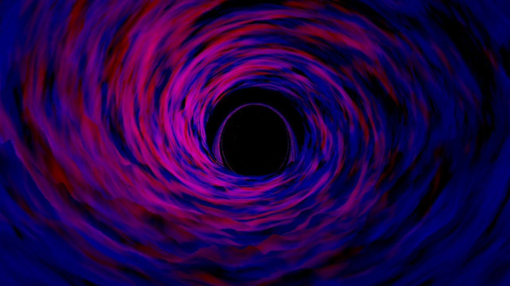

<!DOCTYPE html>
<html>
  <head>
    <link rel="stylesheet"type="text/css" href="new-1.css"> 
  </head>
  <body>
    <h1>Info</h1>
    
    <ul>

      <a href="index.html"><li>Home</li></a>
      <a href="Info.html"><li>Info</li></a>
      <a href="Images.html"><li>Images</li></a>
      <a href="Types.html"><li>Types</li></a>
      <a href="Facts.html"><li>Facts</li></a>

    </ul>
  
 Black holes are voids of space and time and suck up anything close an enough to it's range. however the milky ways black hole is light years away. it can't find it's way to earth because it is to far away and have you ever herd of a interstellar Black hole if you haven't this could be helpful for you. if you barly know anything about Black holes a interstellar Black hole. is a Black hole that has a ring around it like satern. and a supermasseve Black hole is a relly masseve Black 
    hole! 
 <ol>
    <li>  Astronomers have spotted four "strange" objects orbiting the massive black hole at the center of the Milky Way galaxy, a new study says. The objects, known as G3, G4, G5 and G6, could be gas clouds, according to some astronomers, but others believe they may be stars covered in ... </li>
    <li>Black holes are volumes of space where gravity is extreme enough to prevent the escape of even the fastest moving particles. Not even light can break free, ...</li><li> - Black holes are dark spots in the fabric of space-time, incredibly dense singularities with such strong gravity that nothing can escape their ...</li><li>Black holes are objects with an intense gravitational pull so strong that not even beams of light, the fastest things in the universe, can escape. This makes them ...</li><li>A black hole is a region of spacetime exhibiting gravitational acceleration so strong that nothing—no particles or even electromagnetic radiation such as light—can escape from it. The theory of general relativity predicts that a sufficiently compact mass can deform spacetime to form a black hole.</li><li>Don't let the name fool you: a black hole is anything but empty space. Rather, it is a great amount of matter packed into a very small area - think of a star ten ...</li><li>Black holes are volumes of space where gravity is extreme enough to prevent the escape of even the fastest moving particles. ... Schwarzschild realised it was possible for mass to be squeezed into an infinitely small point. ... The cusp of the black hole's slide into oblivion is today ...</li><li> Black holes are some of the strangest and most fascinating objects in outer space. They're extremely dense, with such strong gravitational ...</li><li>Black hole, cosmic body of extremely intense gravity from which nothing, not even light, can escape. It can be formed by the death of a massive star wherein its ...</li>
    </ol><iframe width="590" height="400" src="https://www.youtube.com/embed/26ilf0jO_ZM" frameborder="0" allow="accelerometer; autoplay; encrypted-media; gyroscope; picture-in-picture" allowfullscreen></iframe> 
 
    <iframe width="609" height="400" src="https://www.youtube.com/embed/e-P5IFTqB98" frameborder="0" allow="accelerometer; autoplay; encrypted-media; gyroscope; picture-in-picture" allowfullscreen></iframe><iframe width="700" height="700" src="https://www.youtube.com/embed/uyMtsyzXWd4" frameborder="0" allow="accelerometer; autoplay; encrypted-media; gyroscope; picture-in-picture" allowfullscreen></iframe>
Black holes are volumes of space where gravity is extreme enough to prevent the escape of even the fastest moving particles. Not even light can break free, hence the name 'black' hole. 
    <line>

    
A German physicist and astronomer named Karl Schwarzschild proposed the modern version of a black hole in 1915 after coming up with an exact solution to Einstein's approximations of general relativity.

    Schwarzschild realised it was possible for mass to be squeezed into an infinitely small point. This would make spacetime around it bend so that nothing – not even massless photons of light – could escape its curvature.

    The cusp of the black hole's slide into oblivion is today referred to as its event horizon, and the distance between this boundary and the infinitely dense core – or singularity – is named after Schwarzschild.

    Theoretically, all masses have a Schwarzschild radius that can be calculated. If the Sun's mass was squeezed into an infinitely small point, it would form a black hole with a radius of just under 3 kilometres (about 2 miles).

    Similarly, Earth's mass would have a Schwarzschild radius of just a few millimetres, making a black hole no bigger than a marble.

    For decades, black holes were exotic peculiarities of general relativity. Physicists have became increasingly confident in their existence as other extreme astronomical objects, such as neutron stars, were discovered. Today it's believed most galaxies have monstrous black holes at their core.

    How do black holes form?
    It's generally accepted that stars with a mass at least three times greater than that of our Sun's can undergo extreme gravitational collapse once their fuel depletes.

    With so much mass in a confined volume, the collective force of gravity overcomes the rule that usually keeps the building blocks of atoms from occupying the same space. All this density creates a black hole.

      A second type of miniature black hole has been hypothesised, though never observed. They're thought to have formed when the rippling vacuum of the early Universe rapidly expanded in an event known as inflation, causing highly dense regions to collapse. 

      Called primordial black holes, they'd have a smaller mass – some even close to that of Earth – but would be little bigger than a jelly bean. Who knew black holes could be so cute? 
  Black holes are dark spots in the fabric of space-time, incredibly dense singularities with such strong gravity that nothing can escape their clutches. They spend their time doing one thing: gobbling up matter. Get close enough to a black hole, and you're cosmic spaghetti, stretched to bits, sucked inward, never to return. Simple and straightforward, right? 

  
But as it turns out, black holes are more than just cosmic vacuum cleaners. In 2019, physicists peered into the fathomless darkness and snapped the first-ever picture of a black hole. They also learned more about how these bizarre and insatiable beasts work. From their propensity to gain and lose hair, to their mysterious innards, to where they may lead, here are 14 new things we learned about black holes in 2019.

</html>
